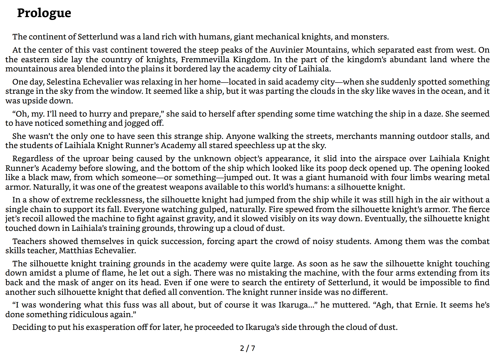
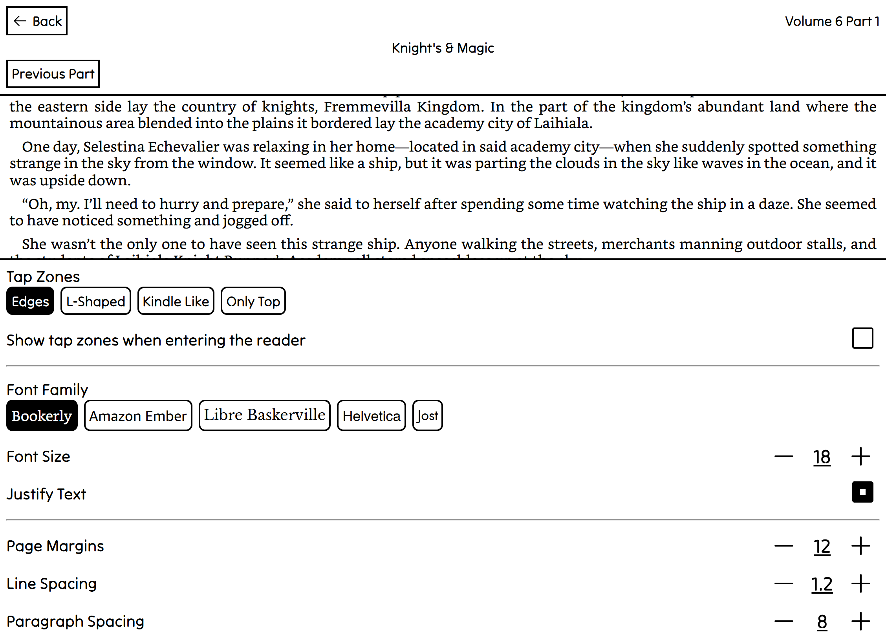
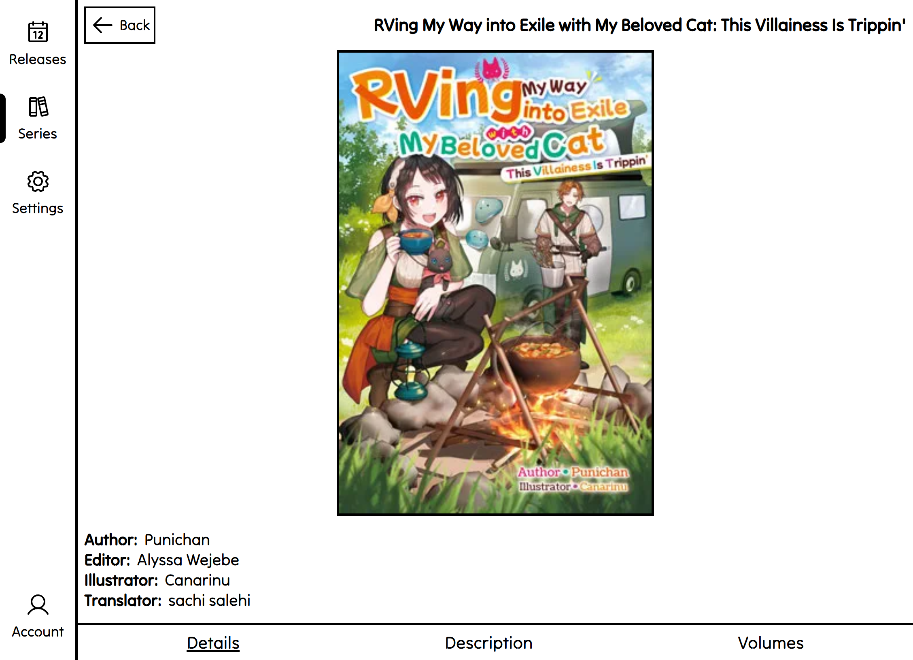
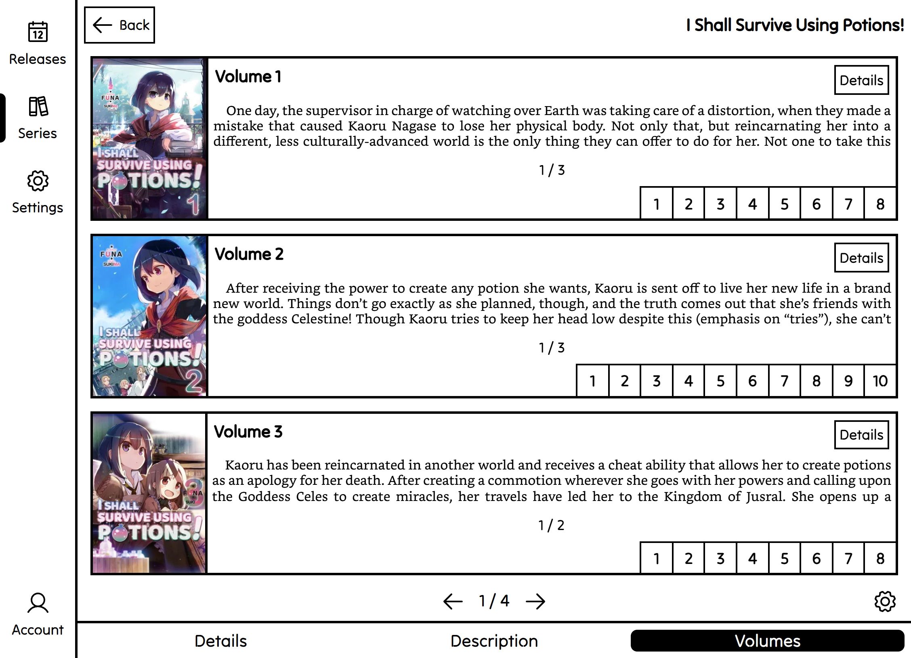
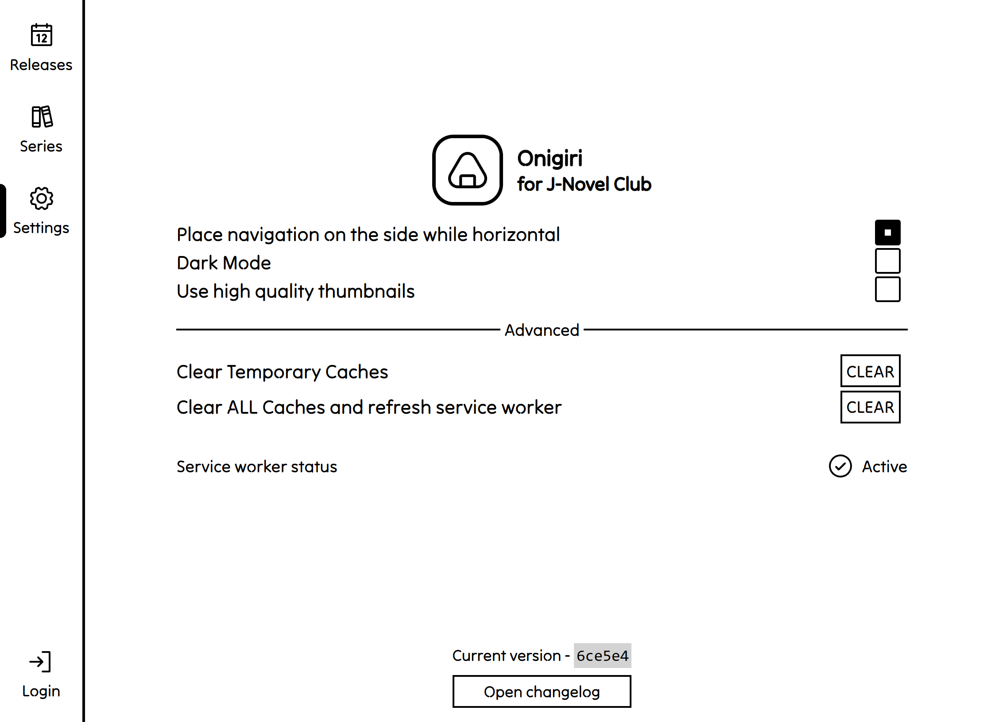

    
     
    <h1 align="center">Onigiri for J-Novel Club</h1>
    <h3 align="center">A minimalistic, E-Ink screen optimised 3rd party <a href="https://j-novel.club">J-Novel Club</a> client</h3>
 

## Screenshots

    

|            **Reader**                  |    **Releases**        |
|:------------------------------------------------------------------------------------------------:|:------------------------------------------------------------------------------------:|
| **Reader settings**  | **Series View**  |
|       **List view (Beta)**         |   **Settings**         |

## Features

- Fully static [Progressive Web Application](https://developer.mozilla.org/en-US/docs/Web/Progressive_web_apps) - no
  data is sent anywhere but the original J-Novel Club servers
- No-frills, minimalistic design that avoids ghosting
- Properly paged reading experience - no scrolling, proper paragraph and line splitting.
- Dark mode support
- Supports many E-Readers (see [Device Support](#E-Reader-Device-support) for more info), Smartphones, Tablets, and
  Desktops

---

## E-Reader Device support

### TL;DR:

- Android (7.0 and newer) ✅ - Report any issues [here](https://github.com/Bruhtek/Onigiri/issues)
- Kindle browser ❓ - When testing I get a white screen, I am unable to debug on this platform, any contributions
  welcome, even any idea how to open a web console (if it exists) would be helpful.
- Anything else ❓ - Try it and report back!

---
The app is primarily tested on the Onyx Boox Note Air 2 on Kiwi Browser, as that is the hardware that I own. However, it
should work on any modern E-Ink device that can run a relatively recent browser (except Kindles) and especially any
Android 7.0+ should be guaranteed to work.

As of time of writing (*2024-12-22*), the following e-readers have Android:

- Any **Onyx Boox**
- Any **inkBoox**
- Some **PocketBooks** (check on their website!)

Trying to open the app on the Kindle browser results in white screen. I am unfortunately unable to debug, as I do not
know of any way to open DevTools, or even console on the Kindle browser. **Any contributions are welcome!**

---

    Copyright (C) 2024 Bartosz Kasperski

    This program is free software: you can redistribute it and/or modify
    it under the terms of the GNU Affero General Public License as published
    by the Free Software Foundation, either version 3 of the License, or
    (at your option) any later version.

    This program is distributed in the hope that it will be useful,
    but WITHOUT ANY WARRANTY; without even the implied warranty of
    MERCHANTABILITY or FITNESS FOR A PARTICULAR PURPOSE.  See the
    GNU Affero General Public License for more details.

    You should have received a copy of the GNU Affero General Public License
    along with this program.  If not, see <https://www.gnu.org/licenses/>.